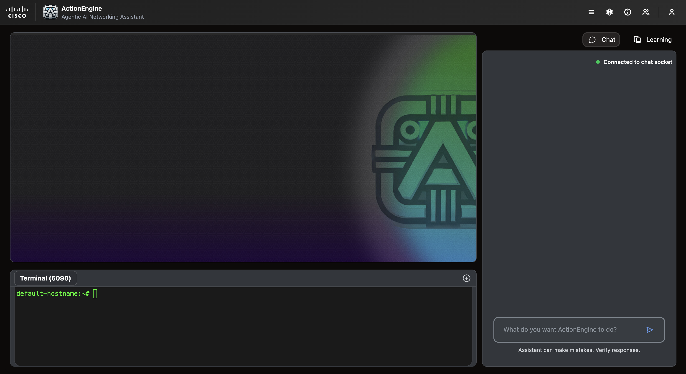
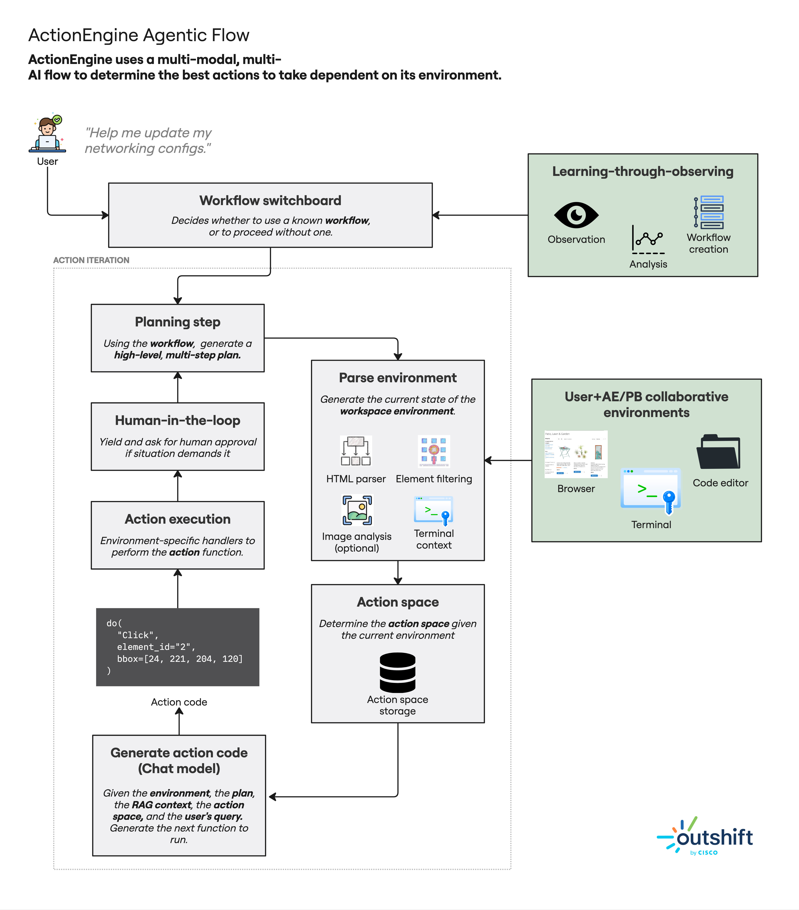
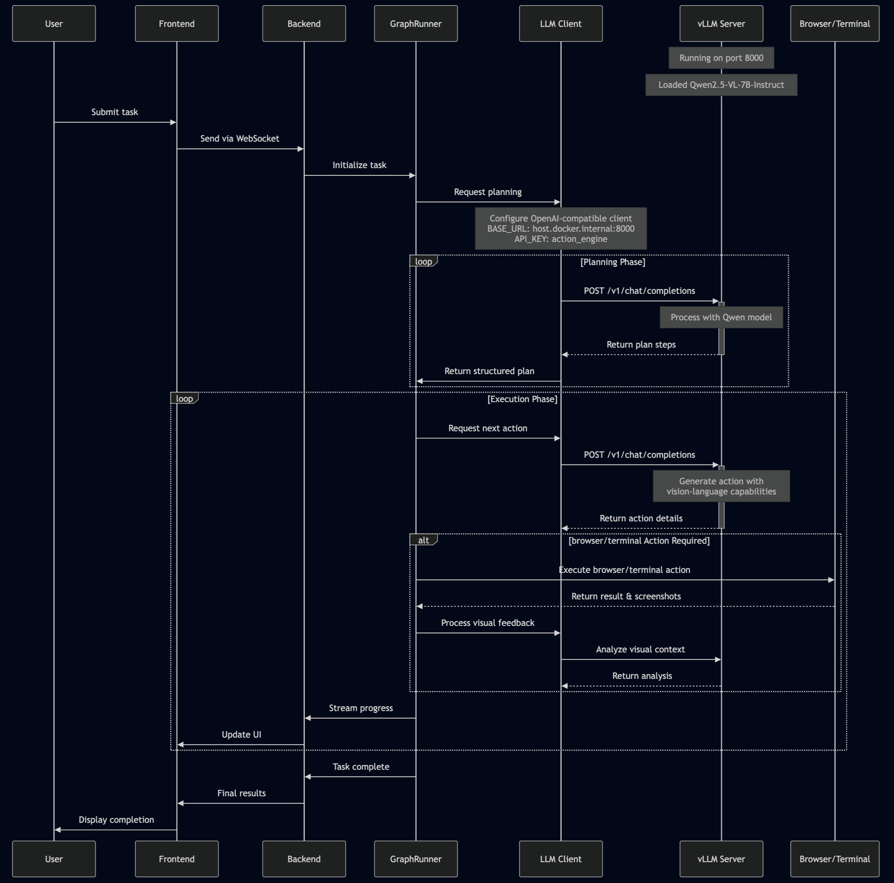

# AGNTCY ActionEngine: Browser and Terminal Actions AI Agent

[](CHANGELOG.md)
[](CODE_OF_CONDUCT.md)

## Overview

The **Browser and Terminal Actions AI Agent** conforms to AGNTCY specs as described https://github.com/agntcy.

## **📌 About the Project**

This repository contains a **Browser and Terminal AI Agent** application.

This project is part of the [**AGNTCY**](https://docs.agntcy.org/pages/introduction.html) initiative — an open source collective building the infrastructure for the **Internet of Agents (IoA)**: a secure, interoperable layer for agent-to-agent collaboration across organizations and platforms.

The Browser and Terminal AI Agent is designed to operate in different environments (browser/terminal) and take actions based on the state of those environments and how their actions affect the environment.
The agent learns from experiences, can be taught by the user, and can improve its performance over time. The agent can make decisions based on the information they receive and their own goals.



## Requirements

- Python 3.11+
- brew install uv
- A virtual environment is recommended for isolating dependencies.
  ```bash
  uv venv --python 3.11
  source .venv/bin/activate
  ```
- Node v20.9.0
  ```bash
  nvm install 20.9
  nvm use 20.9
  ```

## Installation

1. Clone the repository:

   ```bash
   git clone https://wwwin-github.cisco.com/ActionEngine/action-engine-agntcy-agent
   cd action-engine-agntcy-agent
   ```

2. Install the dependencies:

   ```bash
   uv pip install -r requirements.txt
   ```

## Environment Setup

Before using the agent, you need to configure the environment variables.

### **1️⃣ Set Up Environment Variables**

Copy the example environment file and configure it with your credentials:

```bash
cp .env.example .env
```

The `.env` file needs to be configured with the following credentials:

```bash
# AI Model Configuration
LLM_PROVIDER="your_llm_provider"
LLM_MODEL_NAME="your_model_name"
LLM_TEMPERATURE=1.0
LLM_BASE_URL="your_llm_base_url"
LLM_API_KEY="your_api_key"

# Add other required environment variables
...
```

> ⚠️ **Important**: The services require a properly configured `.env` file in the root directory.
> This file will be automatically copied to the backend directory when running the services.

---

## Running the Application

### Quick Start (Docker)

1. First, ensure you have configured your `.env` file as described in the [Environment Setup](#environment-setup) section above.

2. Initialize git submodules:

```bash
git submodule update --init --recursive
```

3. Start all services using Docker Compose:

```bash
docker compose up --build
```

This will:

- Build and start the backend services (with API)
- Build and start the frontend development server
- Mount your `.env` file into the backend container
- Set up networking between services

After startup completes, you can access:

- Frontend at: http://localhost:5173
- Backend API at: http://localhost:7788

To stop all services:

```bash
docker compose down
```

### Development Notes

- Both frontend and backend code are mounted as volumes, enabling hot-reload during development
- Services communicate over an internal Docker network
- All environment variables are properly passed to the services

On a successful run, you should see this on `http://localhost:5173/`:


### Architecture Overview



The ActionEngine AI flow is designed to facilitate the interaction between the user, the AI agent, and the environment (browser/terminal). The flow includes:

- **User Input**: The user provides input through the frontend interface.
- **AI Agent**: The AI agent processes the input, interacts with the environment, and takes actions based on the state of the environment.
- **Environment Interaction**: The agent interacts with the browser or terminal environment, executing commands and observing changes.

### Sequence Diagram



## Roadmap

See the [open issues](https://github.com/cisco-outshift-ai-agents/action-engine-agntcy-agent/issues) for a list
of proposed features (and known issues).

## Contributing

Contributions are what make the open source community such an amazing place to
learn, inspire, and create. Any contributions you make are **greatly
appreciated**. For detailed contributing guidelines, please see
[CONTRIBUTING.md](CONTRIBUTING.md)

## License

Distributed under the `Apache-2.0` License. See [LICENSE](LICENSE) for more
information.

## Contact

[cisco-outshift-ai-agents@cisco.com](mailto:cisco-outshift-ai-agents@cisco.com)

## Acknowledgements

- [Langgraph](https://github.com/langchain-ai/langgraph) for the agentic platform.
- [https://github.com/othneildrew/Best-README-Template](https://github.com/othneildrew/Best-README-Template), from which this readme was adapted

For more information about our various agents, please visit the [agntcy project page](https://github.com/agntcy).
